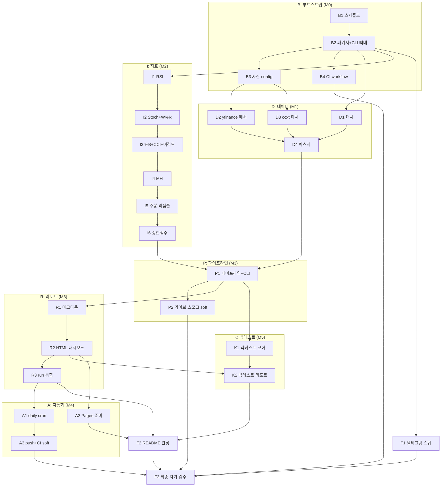

# AUTOPILOT — overbought_oversold_assets 자동 빌드 마스터 프롬프트

> **이 파일은 불변이다.** 빌드 도중 이 파일과 CLAUDE.md는 절대 수정하지 않는다.
> 진행 기록은 오직 STATE.md에만 남긴다 (§4.4 규칙 준수).

---

## 0. 시동 방법

새 세션에서 아래 한 줄이면 빌드가 시작(또는 재개)된다:

> **"AUTOPILOT.md와 STATE.md를 읽고, LOOP 프로토콜에 따라 모든 노드가 DONE 또는 WARN이 될 때까지 자율적으로 계속 작업하라. 질문하지 말고, 막히면 BLOCKED 규칙을 따르라."**

- 새 세션은 반드시 **§4.3 세션 재개 프로토콜**부터 수행한다 (STATE.md와 git 상태 확인 후 루프 진입).
- 이미 진행 중인 세션은 §4.1 메인 루프를 계속 돈다.

---

## 1. GOAL — 목표

### 1.1 미션

크립토·주가지수·금리·원자재·환율 **22개 크로스에셋**의 과매수/과매도 상태를 기술적 지표로 매일 스캔하여, **매일 아침(07:30 KST) 한국어 리포트와 GitHub Pages 대시보드로 자동 발행**하는 시스템을 이 저장소에 완성한다. 외부 API 키·시크릿 없이 공개 데이터만 사용한다.

### 1.2 완성 정의 (Definition of Done)

- [ ] 22개 자산의 일봉+주봉 스캔이 커맨드 하나(`python -m oo_scan run`)로 동작한다
- [ ] 매일 07:30 KST 크론이 한국어 리포트(`reports/YYYY-MM-DD.{md,html}` + `latest.*`)를 생성·커밋한다
- [ ] GitHub Pages 대시보드(`docs/index.html`)가 존재하며 외부 리소스(`src=`/`<link`) 0개로 자급자족한다
- [ ] CI(ruff + pytest)가 green이고 테스트가 40개 이상이다
- [ ] 백테스트 리포트(`reports/backtest.md`)가 존재한다
- [ ] 저장소 어디에도 시크릿/API 키가 없다 (전부 공개 데이터)
- [ ] README가 설치·사용법·지표 설명·Pages 활성화 절차를 담고 있다
- [ ] STATE.md의 모든 노드가 DONE 또는 WARN이고 BLOCKED가 0개다

### 1.3 마일스톤과 수락 기준

모든 "완료"는 사람 판단이 아니라 **실행 가능한 명령**이다. 전부 exit 0이어야 통과.

| MS | 이름 | 포함 노드 | 수락 기준 (전부 exit 0) |
|----|------|-----------|------------------------|
| M0 | 리포 부트스트랩 | B1 B2 B3 B4 | `pip install -r requirements.txt` · `ruff check .` · `pytest -q` · `python -m oo_scan --help` · `python -c "from oo_scan.config import load_config; a=load_config().assets; assert len(a)>=20, len(a)"` |
| M1 | 데이터 레이어 | D1 D2 D3 D4 | `pytest tests/test_cache.py tests/test_fetch_yf.py tests/test_fetch_crypto.py tests/test_fixtures.py -q` · `python scripts/make_fixtures.py && git diff --exit-code tests/fixtures` |
| M2 | 지표·점수 엔진 | I1–I6 | `pytest tests/test_indicators.py tests/test_score.py -q` (합계 20개 이상 테스트 통과) |
| M3 | 파이프라인·리포트 | P1 P2 R1 R2 R3 | `OO_SCAN_DATA_DIR=tests/fixtures python -m oo_scan run --offline` 이 exit 0, stdout에 자산 5개 이상 + 등급 문자열 출력, `reports/latest.md`·`reports/latest.html`·`docs/index.html`·날짜 파일 생성, `pytest -q` 전체 green. (soft: `python -m oo_scan run --no-write` 가 자산 20개 이상 출력 — 네트워크 불가 시 WARN) |
| M4 | 자동화 | A1 A2 A3 | 두 workflow가 `python -c "import yaml; yaml.safe_load(open(p))"` 통과 · `grep -q "30 22 \* \* \*" .github/workflows/daily.yml` · `grep -q workflow_dispatch .github/workflows/daily.yml` · `test -f docs/.nojekyll` · push 성공 (CI green 확인은 gh 부재 시 WARN) |
| M5 | 백테스트·마무리 | K1 K2 F1 F2 F3 | `pytest tests/test_backtest.py -q` · `OO_SCAN_DATA_DIR=tests/fixtures python -m oo_scan backtest --offline && test -f reports/backtest.md` · 최종 게이트 `ruff check . && pytest -q` (40개 이상 테스트) · §7 자가 검수 체크리스트 전 항목 체크 |

### 1.4 기술 스택과 제약

- Python 3.11+. 의존성은 아래 목록으로 **고정** — `pandas>=2.1`, `numpy>=1.26`, `ccxt>=4.3`, `yfinance>=0.2.40`, `PyYAML>=6.0`, `pytest>=8.0`, `ruff>=0.5` (requirements.txt 하나에 전부).
- **금지**: plotly, jinja2, pyarrow 등 추가 의존성. HTML은 f-string 템플릿 + 인라인 CSS/SVG로 자급자족. 캐시는 CSV.
- 시크릿/API 키/토큰 커밋 절대 금지. 텔레그램은 스텁 모듈만 (env 없으면 no-op).
- 패키지명 `oo_scan`, 리포 루트 flat 레이아웃(no src/), 설치 없이 `python -m oo_scan` 실행 가능 (`pyproject.toml`의 `[tool.pytest.ini_options] pythonpath = ["."]`).

---

## 2. SPEC — 상세 사양

### 2.1 자산 유니버스와 config 스키마

`config/assets.yaml`에 아래 22개 자산을 정의한다. (★ = 맥락상 추천으로 추가된 자산 — yaml 항목 삭제만으로 제거 가능, README에 명시)

| ID | 한글명 | class | source | symbol | 비고 |
|----|--------|-------|--------|--------|------|
| BTC | 비트코인 | crypto | ccxt | BTC/USDT | 폴백 [binance, bybit, gateio, okx] |
| ETH | 이더리움 | crypto | ccxt | ETH/USDT | 폴백 동일 |
| SOL | 솔라나 | crypto | ccxt | SOL/USDT | 폴백 동일 |
| BNB | 비앤비 | crypto | ccxt | BNB/USDT | 폴백 [binance, bybit, gateio] |
| HYPE | 하이퍼리퀴드 | crypto | ccxt | HYPE/USDT | 폴백 [hyperliquid, bybit, gateio], hyperliquid는 HYPE/USDC 오버라이드 |
| SPX | S&P500 | index | yfinance | ^GSPC | |
| NASDAQ | 나스닥 종합 | index | yfinance | ^IXIC | |
| KOSPI | 코스피 | index | yfinance | ^KS11 | |
| KOSDAQ | 코스닥 | index | yfinance | ^KQ11 | |
| NIKKEI | 닛케이225 | index | yfinance | ^N225 | |
| HSI ★ | 항셍 | index | yfinance | ^HSI | |
| SOX ★ | 필라델피아 반도체 | index | yfinance | ^SOX | |
| US10Y | 미국 10년물 금리 | rate | yfinance | ^TNX | display_scale 0.1, unit % |
| US30Y ★ | 미국 30년물 금리 | rate | yfinance | ^TYX | display_scale 0.1, unit % |
| GOLD | 금 | commodity | yfinance | GC=F | |
| SILVER | 은 | commodity | yfinance | SI=F | |
| COPPER | 구리 | commodity | yfinance | HG=F | |
| WTI ★ | WTI 원유 | commodity | yfinance | CL=F | |
| DXY | 달러인덱스 | fx | yfinance | DX-Y.NYB | |
| USDJPY | 달러/엔 | fx | yfinance | JPY=X | |
| USDKRW ★ | 달러/원 | fx | yfinance | KRW=X | |
| VIX ★ | VIX 변동성지수 | vol | yfinance | ^VIX | |

assets.yaml 스키마 예시 (이 형태를 그대로 따른다):

```yaml
assets:
  - id: BTC
    name_ko: 비트코인
    asset_class: crypto
    source: ccxt
    symbol: BTC/USDT
    exchanges: [binance, bybit, gateio, okx]
  - id: HYPE
    name_ko: 하이퍼리퀴드
    asset_class: crypto
    source: ccxt
    symbol: HYPE/USDT
    exchanges: [hyperliquid, bybit, gateio]
    symbol_overrides:
      hyperliquid: HYPE/USDC
  - id: US10Y
    name_ko: 미국 10년물 금리
    asset_class: rate
    source: yfinance
    symbol: "^TNX"
    display_scale: 0.1
    display_unit: "%"
```

`oo_scan/config.py`는 dataclass로 로드·검증한다 (필수 필드 누락·중복 ID·미지원 source는 즉시 에러).

### 2.2 지표 정의와 정규화 공식

**부록 A**의 공식이 유일한 기준이다. 구현과 테스트 기준값 모두 부록 A에서 도출한다.
지표: RSI(14, Wilder), Stochastic Slow(14,3,3), Bollinger %B(20,2), Williams %R(14), CCI(20), 이격도(close/SMA20×100), MFI(14, 볼륨 있는 자산만). 타임프레임: 일봉 + 주봉(리샘플).

### 2.3 종합 점수와 5단계 등급

- 서브점수 정규화(부록 A) 후 **가용한 서브점수의 동일가중 평균**으로 타임프레임 점수 산출.
- **최종 점수 = round(0.6×일봉 점수 + 0.4×주봉 점수)**, 주봉 계산 불가 시 일봉 가중치 1.0.
- 등급 경계 (경계값은 극단 쪽에 포함):

| 최종 점수 | 등급 |
|-----------|------|
| ≥ 60 | 강한 과매수 |
| [30, 60) | 과매수 |
| (−30, 30) | 중립 |
| (−60, −30] | 과매도 |
| ≤ −60 | 강한 과매도 |

### 2.4 CLI 명세

```
python -m oo_scan run       [--offline] [--no-write] [--assets BTC,SPX,...] [--no-cache]
python -m oo_scan fetch     [--assets ...]          # 데이터만 받아 캐시에 저장
python -m oo_scan backtest  [--offline]
```

- `--offline`: 네트워크 호출 금지, 로컬 데이터(캐시 디렉터리)만 사용. 데이터 없는 자산은 skip으로 집계.
- `--no-write`: 리포트 파일을 쓰지 않고 stdout 표만 출력.
- `--assets`: 쉼표 구분 자산 ID 필터.
- env `OO_SCAN_DATA_DIR`: 데이터 디렉터리 오버라이드 (기본 `data/cache`). 테스트 픽스처는 `OO_SCAN_DATA_DIR=tests/fixtures`로 주입.
- **exit code 정책**: 라이브 모드 = 시도한 자산의 70% 이상 산출 시 0. 오프라인 모드 = skip 제외 1개 이상 산출 시 0. 그 외 1.

### 2.5 리포트 형식 (Markdown / HTML)

**Markdown** (`reports/YYYY-MM-DD.md` + `reports/latest.md`) — 섹션 순서:
1. 제목 + 생성 시각(KST)
2. 요약: 과매수 상위 3 · 과매도 상위 3 (한 줄씩)
3. 과매수 랭킹 표 / 과매도 랭킹 표 (점수 |30| 이상만)
4. 전체 자산 표 — 자산군별 그룹. 컬럼: 자산(한글명) / 종가 / 기준일 / 일봉점수 / 주봉점수 / 종합점수 / 등급 / RSI(14)
5. 자산별 상세 (지표 원값)
6. 데이터 누락 (실패 자산과 사유)
7. 각주: 사용 거래소, STALE 표시 설명, 면책 문구

**HTML** (`reports/*.html` + `docs/index.html`) — 단일 파일, 인라인 CSS, 외부 리소스 0. 상단 요약 카드, 종합점수 히트맵 색상(과매수=적색 계열 ↔ 과매도=청색 계열), 자산별 최근 60봉 인라인 SVG 스파크라인. 라이트/다크 무관하게 읽히는 대비.
리포트 생성 함수는 `now` 파라미터 주입을 지원한다 (테스트 결정성).

### 2.6 백테스트 규칙

- **이벤트**: 등급이 중립에서 |점수| ≥ 30 구간(과매수/과매도)으로 **진입한 날**.
- **측정**: 이벤트 후 전방 5/20/60 거래일 종가 수익률.
- **비교**: 같은 자산의 무조건부(전체 기간) 평균 전방 수익률 대비.
- **적중률**: 과매도 신호 → 전방 수익률 양수 비율, 과매수 신호 → 음수 비율.
- 표본 5개 미만은 "표본 부족"으로 표기 (통계 주장 금지).
- 산출: `reports/backtest.md` + `reports/backtest.html` + `docs/backtest.html`, index에서 링크.

### 2.7 디렉터리 구조 (최종 형상)

```
overbought_oversold_assets/
├── AUTOPILOT.md  STATE.md  CLAUDE.md  README.md
├── requirements.txt  pyproject.toml  .gitignore
├── config/assets.yaml           # 자산 유니버스 (22개)
├── oo_scan/
│   ├── __init__.py  __main__.py  cli.py
│   ├── config.py                # yaml 로드·검증 (dataclass)
│   ├── cache.py                 # CSV 캐시, OO_SCAN_DATA_DIR, TTL 12h
│   ├── fetch_yf.py              # yfinance 페처
│   ├── fetch_crypto.py          # ccxt 페처 + 거래소 폴백
│   ├── indicators.py            # RSI/Stoch/%B/W%R/CCI/이격도/MFI/주봉 리샘플
│   ├── score.py                 # 정규화·종합점수·등급
│   ├── pipeline.py              # 전 자산 오케스트레이션 (실패 격리)
│   ├── report_md.py  report_html.py
│   ├── backtest.py
│   └── telegram_stub.py
├── scripts/make_fixtures.py     # 결정적 합성 픽스처 생성기
├── tests/
│   ├── conftest.py
│   ├── fixtures/                # BTC/ETH/SPX/KOSPI/US10Y _1d.csv (커밋됨)
│   └── test_*.py                # config/cache/fetch_yf/fetch_crypto/fixtures/indicators/score/pipeline/report/backtest/notify
├── reports/                     # YYYY-MM-DD.{md,html}, latest.{md,html}, backtest.{md,html} (커밋됨)
├── docs/                        # GitHub Pages: index.html, backtest.html, .nojekyll (커밋됨)
├── data/cache/                  # 로컬 캐시 (gitignore)
└── .github/workflows/
    ├── ci.yml                   # push/PR: ruff + pytest (오프라인)
    └── daily.yml                # cron "30 22 * * *" (07:30 KST) + workflow_dispatch
```

---

## 3. GRAPH — 작업 의존성 그래프

### 3.1 Mermaid 다이어그램



### 3.2 노드 테이블

의존 관계의 **유일한 기준은 이 표다** (다이어그램은 보조). soft 열이 표시된 노드만 WARN 종료가 허용된다.

| ID | 작업 (1줄) | 의존 | 검증 명령 | 그룹 | soft |
|----|-----------|------|-----------|------|------|
| B1 | `.gitignore`·`requirements.txt`·`pyproject.toml`(ruff/pytest 설정)·README 뼈대 생성 | - | `pip install -r requirements.txt && ruff check .` | B | - |
| B2 | `oo_scan/` 패키지 + argparse CLI 뼈대(`run`/`fetch`/`backtest` 서브커맨드 스텁) + 최소 테스트 1개 | B1 | `python -m oo_scan --help && ruff check . && pytest -q` | B | - |
| B3 | `config/assets.yaml` 22개 자산 전체 + `oo_scan/config.py` 로더·검증 + `tests/test_config.py` | B2 | `pytest tests/test_config.py -q && python -c "from oo_scan.config import load_config; assert len(load_config().assets)>=20"` | B | - |
| B4 | `.github/workflows/ci.yml` (push/PR 시 ruff+pytest, 네트워크 無) | B2 | `python -c "import yaml; yaml.safe_load(open('.github/workflows/ci.yml'))" && ruff check . && pytest -q` | B | - |
| D1 | `oo_scan/cache.py` CSV 캐시 (TTL 12h, `OO_SCAN_DATA_DIR` 오버라이드) + 테스트 | B2 | `pytest tests/test_cache.py -q` | D | - |
| D2 | `oo_scan/fetch_yf.py` yfinance 페처 (단일 티커, 컬럼 정규화, 재시도 3회 백오프, sleep 0.7s) + monkeypatch 테스트 | B3 | `pytest tests/test_fetch_yf.py -q` | D | - |
| D3 | `oo_scan/fetch_crypto.py` ccxt 페처 (거래소 폴백 체인, 심볼 오버라이드, enableRateLimit) + fake exchange 테스트 | B3 | `pytest tests/test_fetch_crypto.py -q` | D | - |
| D4 | `scripts/make_fixtures.py` 결정적(seed) 합성 OHLCV 생성 → `tests/fixtures/{BTC,ETH,SPX,KOSPI,US10Y}_1d.csv` 커밋 (US10Y는 volume=0) | D1 D2 D3 | `python scripts/make_fixtures.py && git diff --exit-code tests/fixtures && pytest tests/test_fixtures.py -q` | D | - |
| I1 | `oo_scan/indicators.py` RSI(14, Wilder) + 손계산·경계 테스트 | B2 | `pytest tests/test_indicators.py -q -k rsi` | I | - |
| I2 | Stochastic Slow(14,3,3) + Williams %R(14) + 테스트 | I1 | `pytest tests/test_indicators.py -q -k "stoch or williams"` | I | - |
| I3 | Bollinger %B(20,2) + CCI(20) + 이격도(close/SMA20×100) + 테스트 | I2 | `pytest tests/test_indicators.py -q -k "percent_b or cci or disparity"` | I | - |
| I4 | MFI(14) + volume 유무 자동 판별 규칙 + 테스트 | I3 | `pytest tests/test_indicators.py -q -k mfi` | I | - |
| I5 | 주봉 리샘플 (전통자산 W-FRI, 크립토 W-SUN, ohlc agg) + 테스트 | I4 | `pytest tests/test_indicators.py -q -k weekly` | I | - |
| I6 | `oo_scan/score.py` 서브점수 정규화·가중 종합(-100..+100)·5등급 + 경계/재정규화 테스트 | I5 | `pytest tests/test_score.py -q` | I | - |
| P1 | `oo_scan/pipeline.py` 전 자산 fetch→지표→점수 오케스트레이션(개별 실패 격리) + CLI `run --offline --no-write` 표 출력 | B3 D4 I6 | `OO_SCAN_DATA_DIR=tests/fixtures python -m oo_scan run --offline --no-write && pytest tests/test_pipeline.py -q` | P | - |
| P2 | 라이브 스모크: 실제 네트워크로 3개 자산 fetch·점수 확인, 레이트리밋 동작 점검 | P1 | `python -m oo_scan run --no-write --assets BTC,SPX,GOLD` | P | soft |
| R1 | `oo_scan/report_md.py` 한국어 마크다운 리포트(요약·랭킹·전체표·상세·누락 섹션) + 구조 스모크 테스트 | P1 | `pytest tests/test_report.py -q -k markdown` | R | - |
| R2 | `oo_scan/report_html.py` 단일 파일 HTML(인라인 CSS·SVG 스파크라인·히트맵 색상) + self-contained 테스트 | R1 | `pytest tests/test_report.py -q -k html` | R | - |
| R3 | CLI `run` 통합: `reports/YYYY-MM-DD.{md,html}`+`latest.*`+`docs/index.html` 기록, exit-code 정책, `--no-write`/`--offline` 완성 | R2 | `OO_SCAN_DATA_DIR=tests/fixtures python -m oo_scan run --offline && test -f reports/latest.md && test -f docs/index.html && pytest -q` | R | - |
| A1 | `.github/workflows/daily.yml` (cron `30 22 * * *`+workflow_dispatch, run+backtest, reports/docs 커밋 `[skip ci]`, permissions contents:write, concurrency) | R3 | `python -c "import yaml; yaml.safe_load(open('.github/workflows/daily.yml'))" && grep -q "30 22 \* \* \*" .github/workflows/daily.yml && grep -q workflow_dispatch .github/workflows/daily.yml` | A | - |
| A2 | Pages 준비: `docs/.nojekyll`, README에 Pages 활성화 절차(main·/docs)와 대시보드 URL 안내 | R2 | `test -f docs/index.html && test -f docs/.nojekyll && grep -q "GitHub Pages" README.md` | A | - |
| A3 | 원격 push 및 CI 확인 (gh 없으면 push 성공만 확인) | A1 B4 | `git push origin HEAD` (gh 가능 시 `gh run list --limit 1`) | A | soft |
| K1 | `oo_scan/backtest.py` 신호 추출(등급 진입 이벤트)·전방수익률 5/20/60일·적중률·베이스라인 비교 + 테스트 | P1 | `pytest tests/test_backtest.py -q` | K | - |
| K2 | 백테스트 리포트(`reports/backtest.md`+`.html`, docs 복사, index에서 링크) + CLI `backtest` | K1 R2 | `OO_SCAN_DATA_DIR=tests/fixtures python -m oo_scan backtest --offline && test -f reports/backtest.md` | K | - |
| F1 | `oo_scan/telegram_stub.py` (env 토큰 없으면 no-op·False 반환, 사용법 README 부록) + 테스트 | B2 | `pytest tests/test_notify.py -q` | F | - |
| F2 | README.md 완성(개요·설치·사용법·지표 설명·Pages 안내·텔레그램 부록·면책) 한국어 | R3 K2 A2 | `python -c "s=open('README.md',encoding='utf-8').read(); assert all(k in s for k in ['설치','사용법','GitHub Pages','지표','백테스트'])"` | F | - |
| F3 | 최종 자가 검수: §7 체크리스트 전 항목 실행·STATE 마감 | F1 F2 A3 P2 B4 | `ruff check . && pytest -q && OO_SCAN_DATA_DIR=tests/fixtures python -m oo_scan run --offline` + §7 체크리스트 | F | - |

### 3.3 병렬 실행 규칙

- 그룹(레인) 내부는 표 순서대로 **순차** 실행. 서로 다른 레인은 의존만 충족되면 병렬 가능.
- 실질 병렬 구간: B3/B4 이후 **D-레인 · I-레인 · F1** 동시 진행 가능. P1 이후 **R-레인과 K1** 동시 진행 가능.
- 병렬 실행은 **선택 사항**이다 (서브에이전트/Task 도구가 있을 때만, 동시 최대 2레인). 각 서브에이전트는 자기 레인의 파일 소유 목록만 수정하고 **STATE.md는 절대 건드리지 않는다**. 커밋과 STATE 갱신은 부모 세션이 노드 검증 후 수행한다.
- **확신이 없으면 순차 실행한다 — 순차 실행은 언제나 올바른 폴백이다.**

---

## 4. LOOP — 실행 프로토콜

### 4.1 메인 루프

```text
loop:
  1. STATE.md 읽기 → 노드 상태 맵 구성
  2. 모든 노드가 DONE 또는 WARN이면 → F3가 DONE인지 확인 후 종료 보고 작성, 루프 탈출
  3. READY = { 상태==PENDING 이고 모든 의존 노드가 DONE 또는 WARN 인 노드 }
  4. READY가 비어 있으면:
     a. IN_PROGRESS 노드가 있으면 → 그 노드를 재개 (4.3 재개 프로토콜)
     b. BLOCKED만 남았으면 → "인간 개입 대기 목록"을 정리해 STATE 로그와 최종 응답에 남기고
        정상 종료 (무한 루프 금지)
  5. 노드 선택: READY 중 표 순서(위→아래)가 빠른 것. (병렬 실행 시 §3.3 규칙)
  6. 선택 노드를 IN_PROGRESS로 표기 (작업 트리 편집만, 커밋은 아직)
  7. 구현: §2 SPEC과 CLAUDE.md 컨벤션 준수, 해당 노드 범위만 수정
  8. 노드 검증 명령 실행 → 실패 시 4.2 수리 루프
  9. 전역 게이트: ruff check . && pytest -q → 실패 시 4.2 수리 루프
  10. git add -A && git commit -m "<ID>: <한글 요약>"  (STATE.md의 DONE 갱신 포함)
  11. 마일스톤 마지막 노드였으면 마일스톤 수락 기준(§1.3) 전체 실행, 통과 로그 기록
  12. goto loop
```

### 4.2 수리 루프

```text
attempt = STATE의 시도 값
while attempt < 3:
  attempt += 1 (STATE 시도 열 갱신)
  실패 출력 분석 → 원인 진단 1줄을 로그에 기록 → 최소 수정 → 검증 재실행
  통과하면 메인 루프 9단계로 복귀
3회 모두 실패하면:
  soft 노드 → 상태 WARN, 비고에 사유 기록. 작업 트리에서 해당 노드의 안전한 부분만 남기고
             커밋 (남길 것이 없으면 git checkout -- . 로 원복), 다음 노드로 진행
  일반 노드 → 상태 BLOCKED, 비고에 원인+필요 조치 기록, git checkout -- . 로 작업 트리 원복,
             인간 개입 대기 목록에 추가, 의존하지 않는 다른 READY 노드로 진행
주의: 검증 명령 자체를 약화·삭제해서 통과시키는 것 금지. 사양 변경이 필요하면 BLOCKED 처리.
```

### 4.3 세션 재개 프로토콜

```text
새 세션 시작 시:
  1. AUTOPILOT.md 전체 읽기 → STATE.md 읽기 → git log --oneline -10, git status 확인
  2. 작업 트리가 더럽고 IN_PROGRESS 노드가 있으면: 그 노드의 검증 명령 실행
     → 통과: 전역 게이트 후 커밋, DONE 처리
     → 실패: 수리 루프를 STATE의 시도 값에서 이어서 진행
  3. 작업 트리가 더럽지만 IN_PROGRESS가 없으면: diff 검토 후 일관성 없으면 git checkout -- . (로그 기록)
  4. BLOCKED 노드는 새 세션에서 1회에 한해 시도 0으로 리셋해 재도전할 수 있다 (환경이 바뀌었을 수 있음)
  5. 메인 루프 진입
```

### 4.4 STATE.md 관리 규칙

1. 표에서는 **상태/시도/커밋/비고 셀만** 수정한다. 행 추가·삭제·재배열 금지, ID·작업 열 수정 금지.
2. 상태 값은 `PENDING | IN_PROGRESS | DONE | WARN | BLOCKED` 5개만 허용. WARN은 soft 노드 전용.
3. DONE/WARN 전환 시 커밋 열에 짧은 해시(7자) 기록. BLOCKED 시 비고에 원인 1줄 + 필요 조치 필수, 인간 개입 대기 목록에도 항목 추가.
4. 로그는 맨 위에 추가: `- YYYY-MM-DD HH:MM KST [ID] 상태변화 — 한 줄 요약` (120자 이내). 100줄 초과분은 아래에서 삭제.
5. 메타 3줄(마지막 갱신/현재 마일스톤/다음 액션)은 매 갱신마다 갱신.
6. STATE.md 변경은 해당 노드의 코드와 **같은 커밋**에 포함한다 (STATE만 단독 커밋 금지, 단 F3 마감 커밋은 예외).

---

## 5. 가드레일

### 5.1 커밋 규칙

- 커밋 제목: `<ID>: <한글 요약>` (예: `I1: RSI(14) Wilder 구현 및 테스트`). 노드당 정확히 1커밋, STATE.md 갱신 동봉.
- 현재 체크아웃된 브랜치에서 작업한다. 브랜치 변경·생성은 하지 않는다.
- push는 `git push -u origin HEAD`. 네트워크 오류 시 2/4/8/16초 백오프로 최대 4회 재시도.

### 5.2 금지 사항

- force-push·히스토리 재작성 금지.
- **AUTOPILOT.md / CLAUDE.md 수정 금지** (STATE.md만 갱신 가능).
- 검증 명령을 약화·삭제해서 통과시키기 금지 (수리 루프 참조).
- 시크릿·토큰·API 키 커밋 금지.
- 테스트에서 실제 네트워크 호출 금지 (monkeypatch + 픽스처만).
- §1.4 목록 밖의 새 의존성 추가 금지. 불가피하면 STATE 로그에 사유를 남기고 최소한으로.

### 5.3 외부 데이터·네트워크 대응

- 라이브 네트워크 검증은 soft 노드(P2, A3)에만 존재 — 실패 시 WARN으로 기록하고 진행한다. 실제 라이브 검증은 daily.yml의 첫 실행이 담당한다.
- CI와 모든 하드 수락 게이트는 오프라인(픽스처)으로만 동작한다.
- 페처 재시도 정책: 3회 지수 백오프, 호출 간 sleep, 빈 응답은 실패로 간주 후 해당 자산 skip.

### 5.4 인간 개입이 필요한 항목 (빌드가 STATE에 기록해야 함)

1. **작업 브랜치 → main 머지** (daily cron은 기본 브랜치에서만 동작)
2. **GitHub Pages 활성화**: Settings → Pages → Deploy from a branch → `main` / `/docs`
3. (필요 시) Settings → Actions → Workflow permissions에서 쓰기 권한 허용
4. (선택) 텔레그램 봇 토큰 등록 — 없어도 시스템은 완전 동작

---

## 6. 리스크·엣지 케이스 대응표

| 리스크 | 대응 (구현 규칙) |
|--------|------------------|
| yfinance 레이트리밋/간헐 실패 | 티커당 1개씩 `yf.download(sym, period="2y", interval="1d", auto_adjust=False, progress=False)`, 호출 간 `time.sleep(0.7)`, 3회 지수 백오프 재시도, 빈 DataFrame은 실패로 간주 후 자산 스킵 |
| yfinance MultiIndex 컬럼/auto_adjust 기본값 변경 | 항상 단일 티커 호출 + 컬럼 flatten + `auto_adjust` 명시 |
| ^KS11/^KQ11 결측·지연 | dropna 후 "마지막 가용 봉" 기준 산출; 마지막 봉이 달력일 5일 초과 과거면 리포트에 STALE 표시만 하고 실패 처리하지 않음 |
| ^TNX/^TYX 스케일(값=수익률×10) | config `display_scale: 0.1`, `display_unit: "%"` — 지표 계산은 원값, 표시만 변환 |
| 무볼륨 자산(JPY=X, KRW=X, DX-Y.NYB, ^TNX 등) | volume 컬럼이 없거나 윈도 내 50% 이상이 0/NaN이면 MFI 제외 + 가중치 재정규화 (자동 판별, 설정 불필요) |
| HYPE가 binance에 없음 | 자산별 거래소 폴백 체인: HYPE = `[hyperliquid(HYPE/USDC), bybit(HYPE/USDT), gateio(HYPE/USDT)]`, per-exchange 심볼 오버라이드 필드 지원 |
| GitHub Actions 러너(미국 IP)에서 binance 451 차단 | 모든 크립토에 폴백 체인 적용: BTC/ETH/SOL = `[binance, bybit, gateio, okx]`, BNB = `[binance, bybit, gateio]`; 사용된 거래소를 리포트 각주에 기록 |
| 휴장일 상이(한/미/일 휴일, 크립토 24/7) | 자산별 독립 "마지막 가용 봉" 시맨틱: 각 자산의 최신 봉 기준으로 산출, 리포트에 자산별 기준일 컬럼 표기. 오래된 봉으로 실패시키지 않음 |
| 한 자산 실패가 전체 런을 죽임 | pipeline은 자산별 try/except, 실패 자산은 "데이터 누락" 섹션에 사유와 함께 나열. exit 0 조건은 §2.4 |
| CI가 외부 네트워크에 의존 | 테스트는 전부 오프라인(monkeypatch + 픽스처). 라이브 fetch는 daily.yml에서만. ci.yml은 ruff+pytest만 실행 |
| KST 아침 리포트 cron | `30 22 * * *` UTC = 매일 07:30 KST (서머타임 무관, 미 증시 마감 이후). Actions cron은 최대 1시간 지연 가능 → 08시대 도착 허용, `workflow_dispatch`로 수동 실행 가능 |
| 리포트 커밋 무한 CI 루프/경쟁 | daily.yml 커밋 메시지에 `[skip ci]`, `concurrency: daily-report`, push 전 `git pull --rebase`, 변경 없으면 커밋 생략 |
| Pages 미활성화 가능성 | 산출물은 항상 repo의 `docs/`·`reports/`에 커밋되므로 Pages가 꺼져 있어도 리포트는 존재. 활성화 절차는 §5.4 |
| cron은 기본 브랜치에서만 동작 | 작업 브랜치→main 머지 필요를 인간 개입 목록에 등재 |
| Actions 쓰기 권한 부족 | daily.yml에 `permissions: contents: write` 명시; 그래도 실패 시 README의 안내 절차 참조 |
| 빌드 환경에서 라이브 API 차단 가능 | 라이브 검증(P2, M3 soft 기준)은 실패 시 WARN 기록 후 진행 — 실제 검증은 daily.yml 첫 실행이 담당 |
| HYPE 등 짧은 상장 이력 | 히스토리 부족으로 계산 불가한 지표는 NaN → 종합점수에서 제외·재정규화; 주봉 지표 전체 불가 시 일봉 가중치 1.0 |

---

## 7. 최종 자가 검수 체크리스트 (F3)

각 항목은 커맨드 실행 또는 근거를 남긴 yes/no 확인이다. 전 항목 통과 후 STATE 마감.

- [ ] `ruff check .` → 위반 0건
- [ ] `pytest -q` → 전건 통과, 테스트 40개 이상
- [ ] `OO_SCAN_DATA_DIR=tests/fixtures python -m oo_scan run --offline` → `reports/latest.md`, `reports/latest.html`, `reports/YYYY-MM-DD.*`, `docs/index.html` 4종 생성
- [ ] `docs/index.html`에 외부 `src=`·`<link` 없음 (테스트로 보장됨을 확인)
- [ ] config 자산 20개 이상 + HYPE 폴백 체인 존재
- [ ] 두 workflow yaml 파싱 통과, cron 문자열·`workflow_dispatch`·`[skip ci]`·`contents: write` 확인
- [ ] `git grep -iE "(api_key|token|secret)" -- '*.yml' '*.py'` → 스텁 env 변수명 외 0건
- [ ] README 필수 섹션(설치/사용법/GitHub Pages/지표/백테스트) 존재
- [ ] STATE.md: 전 노드 DONE 또는 WARN(사유 로그 존재), BLOCKED 0
- [ ] git log에 노드별 커밋 존재, force-push 흔적 없음
- [ ] 인간 개입 대기 목록 최신화 (§5.4의 미완 항목 나열)

---

## 부록 A. 지표·점수 공식 (구현·테스트 기준값의 원천)

**지표 정의**
- RSI(14): Wilder 평활 (첫 평균은 단순평균, 이후 `avg = (prev*13 + cur)/14`), RSI ∈ [0, 100]
- Stochastic Slow(14,3,3): FastK(14) → SlowK = SMA3(FastK) → SlowD = SMA3(SlowK). 대표값은 **SlowD**
- Bollinger %B(20,2): `%B = (C − 하단밴드) / (상단밴드 − 하단밴드)`, 밴드 = SMA20 ± 2×표준편차(ddof=0)
- Williams %R(14): `(최고14 − C) / (최고14 − 최저14) × −100`, ∈ [−100, 0]
- CCI(20): `(TP − SMA20(TP)) / (0.015 × MeanDev)`, TP = (H+L+C)/3
- 이격도: `C / SMA20(C) × 100`
- MFI(14): 전형가 기반 자금흐름 비율, ∈ [0, 100]. 볼륨 없는 자산은 계산하지 않음 (§6 자동 판별)

**서브점수 정규화** (모두 [−100, 100] 클립, 과매수 = 양수)
| 지표 | 변환식 |
|------|--------|
| RSI | (RSI − 50) × 2 |
| SlowD | (D − 50) × 2 |
| %B | (%B − 0.5) × 200 |
| W%R | (W%R + 50) × 2 |
| CCI | CCI / 2 |
| 이격도 | (이격도 − 100) × 10 |
| MFI | (MFI − 50) × 2 |

**합성**
- 타임프레임 점수 = 가용(NaN 아닌) 서브점수의 동일가중 평균
- 최종 = `round(0.6 × 일봉 + 0.4 × 주봉)`, 주봉 불가 시 일봉 가중치 1.0
- 등급 경계는 §2.3 표를 따른다

**주봉 리샘플**
- 전통자산: `W-FRI`, 크립토: `W-SUN`. agg: open=first, high=max, low=min, close=last, volume=sum. 미완성 마지막 주 포함 (최신 상태 반영)

**테스트 지침**
- 램프(단조 증가)/상수/교대 등 손계산 가능한 소형 시계열로 정확값 검증
- 경계 속성 테스트: RSI ∈ [0,100], W%R ∈ [−100,0], 서브점수·종합점수 ∈ [−100,100]
- 픽스처 회귀 스모크: 구조 검증 (바이트 일치 비교 금지)

## 부록 B. workflow 뼈대 (핵심 필드 — A1/B4에서 완성)

```yaml
# .github/workflows/ci.yml
name: CI
on: [push, pull_request]
jobs:
  test:
    runs-on: ubuntu-latest
    steps:
      - uses: actions/checkout@v4
      - uses: actions/setup-python@v5
        with: { python-version: "3.11" }
      - run: pip install -r requirements.txt
      - run: ruff check .
      - run: pytest -q
```

```yaml
# .github/workflows/daily.yml
name: Daily Report
on:
  schedule:
    - cron: "30 22 * * *"   # 07:30 KST
  workflow_dispatch:
permissions:
  contents: write
concurrency:
  group: daily-report
jobs:
  report:
    runs-on: ubuntu-latest
    steps:
      - uses: actions/checkout@v4
      - uses: actions/setup-python@v5
        with: { python-version: "3.11" }
      - run: pip install -r requirements.txt
      - run: python -m oo_scan run
      - run: python -m oo_scan backtest
      - name: Commit report
        run: |
          git config user.name "github-actions[bot]"
          git config user.email "github-actions[bot]@users.noreply.github.com"
          git add reports docs
          git diff --cached --quiet || git commit -m "daily report: $(date -u +%F) [skip ci]"
          git pull --rebase origin main
          git push
```
