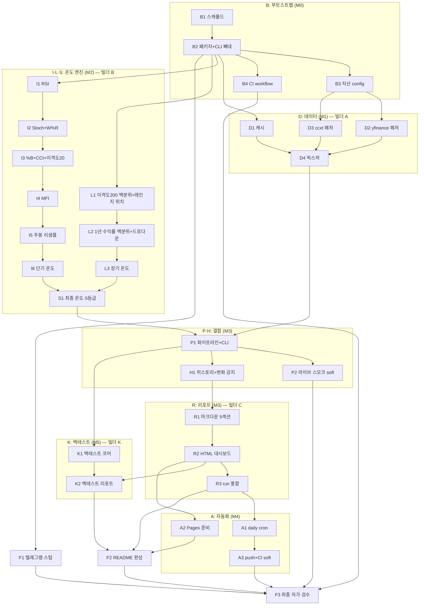

# AUTOPILOT — overbought_oversold_assets 자동 빌드 마스터 프롬프트 (v2)

> **이 파일은 불변이다.** 빌드 도중 이 파일과 CLAUDE.md는 절대 수정하지 않는다.
> 진행 기록은 오직 STATE.md에만 남긴다 (§4.4 규칙 준수).

---

## 0. 시동 방법

새 세션에서 아래 한 줄이면 빌드가 시작(또는 재개)된다:

> **"AUTOPILOT.md와 STATE.md를 읽고, LOOP 프로토콜에 따라 모든 노드가 DONE 또는 WARN이 될 때까지 자율적으로 계속 작업하라. 질문하지 말고, 막히면 BLOCKED 규칙을 따르라."**

- 새 세션은 반드시 **§4.3 세션 재개 프로토콜**부터 수행한다.
- 이미 진행 중인 세션은 §4.1 메인 루프를 계속 돈다.

---

## 1. GOAL — 목표

### 1.1 미션

이 시스템은 **자산배분 관점의 광기–소외 온도계**다. 매일 아침 10분, 크립토·주가지수(선진국+신흥국)·금리·원자재·환율 **28개 크로스에셋**의 광기↔소외 온도를 객관적 지표로 측정한 한국어 리포트를 읽고 — 시장 전체의 쏠림을 파악하고, 과열된 곳에서 물러나며, **소외된 자산에서 형성되는 기회를 남보다 먼저 인지**하게 한다. 외부 API 키·시크릿 없이 공개 데이터만 사용한다.

단타용 시그널 봇이 아니다. 그래서 온도 측정은 단기(오실레이터)만이 아니라 **장기(구조적 광기/소외)** 를 함께 본다.

### 1.2 완성 정의 (Definition of Done)

- [ ] 커맨드 하나(`python -m oo_scan run`)로 28개 자산의 **단기+장기 온도와 5단계 등급**(광기/과열/중립/소외/깊은 소외) 산출
- [ ] 매일 07:30 KST 크론이 **5섹션 리포트**(온도계→소외 존→광기 존→변화 감지→상세)를 생성·커밋 — 핵심 3섹션이 상단 1페이지
- [ ] **등급 변화 감지**가 스코어 히스토리(`reports/history.csv`)와의 비교로 동작 (소외→중립 복귀 = 기회 형성 신호로 강조)
- [ ] GitHub Pages 대시보드(`docs/index.html`)가 외부 리소스 0개로 자급자족
- [ ] 백테스트 리포트가 **"소외/깊은 소외 진입 시 매수했다면 이후 1/3/6개월 성과가 단순 보유 대비 어땠나"** 를 자산별로 보여줌
- [ ] CI(ruff + pytest) green, 테스트 40개 이상, 저장소에 시크릿 0개
- [ ] README 완비, STATE.md 전 노드 DONE/WARN·BLOCKED 0

**비목표**: 매매 자동화·비중 추천은 하지 않는다. 판단 재료를 한눈에 주는 것까지가 이 시스템의 일이다.

### 1.3 마일스톤과 수락 기준

모든 "완료"는 실행 가능한 명령이다. 전부 exit 0이어야 통과.

| MS | 이름 | 포함 노드 | 수락 기준 (전부 exit 0) |
|----|------|-----------|------------------------|
| M0 | 리포 부트스트랩 | B1 B2 B3 B4 | `pip install -r requirements.txt` · `ruff check .` · `pytest -q` · `python -m oo_scan --help` · `python -c "from oo_scan.config import load_config; a=load_config().assets; assert len(a)>=26, len(a)"` |
| M1 | 데이터 레이어 | D1 D2 D3 D4 | `pytest tests/test_cache.py tests/test_fetch_yf.py tests/test_fetch_crypto.py tests/test_fixtures.py -q` · `python scripts/make_fixtures.py && git diff --exit-code tests/fixtures` |
| M2 | 온도 엔진 (단기+장기) | I1–I6 L1–L3 S1 | `pytest tests/test_indicators.py tests/test_long_term.py tests/test_score.py -q` (합계 25개 이상 테스트 통과) |
| M3 | 파이프라인·히스토리·리포트 | P1 P2 H1 R1 R2 R3 | `OO_SCAN_DATA_DIR=tests/fixtures python -m oo_scan run --offline` 이 exit 0, stdout에 자산 5개 이상+등급 출력, `reports/latest.md`·`reports/latest.html`·`reports/history.csv`·`docs/index.html` 생성, `pytest -q` 전체 green. (soft: `python -m oo_scan run --no-write` 자산 25개 이상 — 네트워크 불가 시 WARN) |
| M4 | 자동화 | A1 A2 A3 | 두 workflow yaml 파싱 통과 · `grep -q "30 22 \* \* \*" .github/workflows/daily.yml` · `grep -q workflow_dispatch .github/workflows/daily.yml` · `test -f docs/.nojekyll` · push 성공 (CI green 확인은 gh 부재 시 WARN) |
| M5 | 백테스트·마무리 | K1 K2 F1 F2 F3 | `pytest tests/test_backtest.py -q` · `OO_SCAN_DATA_DIR=tests/fixtures python -m oo_scan backtest --offline && test -f reports/backtest.md` · 최종 게이트 `ruff check . && pytest -q` (40개 이상) · §7 체크리스트 전 항목 |

### 1.4 기술 스택과 제약

- Python 3.11+. 의존성 **고정**: `pandas>=2.1`, `numpy>=1.26`, `ccxt>=4.3`, `yfinance>=0.2.40`, `PyYAML>=6.0`, `pytest>=8.0`, `ruff>=0.5` (requirements.txt 하나).
- **금지**: plotly·jinja2·pyarrow 등 추가 의존성. HTML은 f-string + 인라인 CSS/SVG. 캐시는 CSV.
- 시크릿/API 키/토큰 커밋 절대 금지. 텔레그램은 스텁만 (env 없으면 no-op).
- 패키지명 `oo_scan`, 리포 루트 flat 레이아웃, 설치 없이 `python -m oo_scan` 실행 (`pyproject.toml`에 `[tool.pytest.ini_options] pythonpath=["."]`).
- **장기 온도 때문에 데이터는 약 4년치**를 확보한다 (yfinance `period="4y"`, ccxt는 페이지네이션으로 ~1,100봉).

---

## 2. SPEC — 상세 사양

### 2.1 자산 유니버스와 config 스키마

`config/assets.yaml`에 28개 자산. (★ = 추천 추가분, ✚ = 신흥국 지수 ETF 기본 세트 — 어느 쪽이든 yaml 항목 수정만으로 교체·제거 가능, README에 명시. 사용자가 따로 모아둔 신흥국 ETF 목록을 제공하면 ✚ 세트를 그것으로 교체한다)

| ID | 한글명 | class | source | symbol | 비고 |
|----|--------|-------|--------|--------|------|
| BTC | 비트코인 | crypto | ccxt | BTC/USDT | 폴백 [binance, bybit, gateio, okx] |
| ETH | 이더리움 | crypto | ccxt | ETH/USDT | 폴백 동일 |
| SOL | 솔라나 | crypto | ccxt | SOL/USDT | 폴백 동일 |
| BNB | 비앤비 | crypto | ccxt | BNB/USDT | 폴백 [binance, bybit, gateio] |
| HYPE | 하이퍼리퀴드 | crypto | ccxt | HYPE/USDT | 폴백 [hyperliquid, bybit, gateio], hyperliquid는 HYPE/USDC 오버라이드. 상장 이력 짧음 → §2.3 데이터 부족 규칙 |
| SPX | S&P500 | index | yfinance | ^GSPC | |
| NASDAQ | 나스닥 종합 | index | yfinance | ^IXIC | |
| KOSPI | 코스피 | index | yfinance | ^KS11 | |
| KOSDAQ | 코스닥 | index | yfinance | ^KQ11 | |
| NIKKEI | 닛케이225 | index | yfinance | ^N225 | |
| HSI ★ | 항셍 | index | yfinance | ^HSI | |
| SOX ★ | 필라델피아 반도체 | index | yfinance | ^SOX | |
| EEM ✚ | 신흥국 전체 (MSCI EM) | em_index | yfinance | EEM | |
| MCHI ✚ | 중국 (MSCI China) | em_index | yfinance | MCHI | |
| INDA ✚ | 인도 (MSCI India) | em_index | yfinance | INDA | |
| EWZ ✚ | 브라질 (MSCI Brazil) | em_index | yfinance | EWZ | |
| VNM ✚ | 베트남 (VanEck Vietnam) | em_index | yfinance | VNM | |
| EWT ✚ | 대만 (MSCI Taiwan) | em_index | yfinance | EWT | |
| US10Y | 미국 10년물 금리 | rate | yfinance | ^TNX | display_scale 0.1, unit % |
| US30Y ★ | 미국 30년물 금리 | rate | yfinance | ^TYX | display_scale 0.1, unit % |
| GOLD | 금 | commodity | yfinance | GC=F | |
| SILVER | 은 | commodity | yfinance | SI=F | |
| COPPER | 구리 | commodity | yfinance | HG=F | |
| WTI ★ | WTI 원유 | commodity | yfinance | CL=F | |
| DXY | 달러인덱스 | fx | yfinance | DX-Y.NYB | |
| USDJPY | 달러/엔 | fx | yfinance | JPY=X | |
| USDKRW ★ | 달러/원 | fx | yfinance | KRW=X | |
| VIX ★ | VIX 변동성지수 | vol | yfinance | ^VIX | |

스키마 예시:

```yaml
assets:
  - id: BTC
    name_ko: 비트코인
    asset_class: crypto
    source: ccxt
    symbol: BTC/USDT
    exchanges: [binance, bybit, gateio, okx]
  - id: HYPE
    name_ko: 하이퍼리퀴드
    asset_class: crypto
    source: ccxt
    symbol: HYPE/USDT
    exchanges: [hyperliquid, bybit, gateio]
    symbol_overrides:
      hyperliquid: HYPE/USDC
  - id: US10Y
    name_ko: 미국 10년물 금리
    asset_class: rate
    source: yfinance
    symbol: "^TNX"
    display_scale: 0.1
    display_unit: "%"
```

`oo_scan/config.py`는 dataclass 로드·검증 (필수 필드 누락·중복 ID·미지원 source 즉시 에러).

### 2.2 온도 측정 — 이원화 구조

**단기 온도** (지금 과열/침체 — 일봉·주봉 오실레이터): RSI(14, Wilder), Stochastic Slow(14,3,3), Bollinger %B(20,2), Williams %R(14), CCI(20), 이격도20(close/SMA20×100), MFI(14, 볼륨 있는 자산만). 일봉+주봉 두 타임프레임.

**장기 온도** (구조적 광기/소외 — 이 시스템의 핵심): 
- SMA200 이격도의 **자기 역사(3년) 대비 백분위** — 자산군마다 변동성이 달라도 비교 가능
- **52주 레인지 위치** (0%=바닥, 100%=천장)
- **3년 레인지 위치**
- **1년(252거래일) 수익률의 자기 역사(3년) 대비 백분위**
- 표시 전용(점수 미포함): 3년 고점 대비 드로다운 %, **소외 지속 기간**(고점 이후 경과 거래일)

정확한 공식·정규화는 **부록 A**가 유일한 기준이다.

### 2.3 종합 온도와 5단계 등급

- 단기 온도 = 일봉 서브점수 평균×0.6 + 주봉 서브점수 평균×0.4 (가용 서브점수만, NaN 제외 재정규화)
- 장기 온도 = 장기 서브점수 4개의 가용분 동일가중 평균
- **최종 온도 = round(0.4×단기 + 0.6×장기)** — 자산배분 관점이므로 장기 비중이 크다. 한쪽이 NaN이면 다른 쪽 100%.
- **데이터 부족 규칙**: 종가 봉 수 < 60 → 등급 산정 제외("데이터 부족" 표시만). 60 ≤ 봉 수 < 요구치인 서브점수는 NaN 처리 후 재정규화 (HYPE 등 신생 자산 대응).

| 최종 온도 | 등급 |
|-----------|------|
| ≥ 60 | 광기 |
| [30, 60) | 과열 |
| (−30, 30) | 중립 |
| (−60, −30] | 소외 |
| ≤ −60 | 깊은 소외 |

(경계값은 극단 쪽에 포함)

### 2.4 CLI 명세

```
python -m oo_scan run       [--offline] [--no-write] [--assets BTC,SPX,...] [--no-cache]
python -m oo_scan fetch     [--assets ...]          # 데이터만 받아 캐시에 저장
python -m oo_scan backtest  [--offline]
```

- `--offline`: 네트워크 금지, 로컬 데이터만. 데이터 없는 자산은 skip 집계.
- `--no-write`: 리포트·히스토리 파일 미기록, stdout 표만.
- env `OO_SCAN_DATA_DIR`: 데이터 디렉터리 오버라이드 (기본 `data/cache`). 픽스처 주입용.
- exit 0 조건: 라이브 = 시도 자산의 70% 이상 산출 / 오프라인 = skip 제외 1개 이상 산출.
- `run`은 (--no-write가 아니면) 리포트 기록과 함께 **히스토리 적재와 변화 감지**를 수행한다.

### 2.5 리포트 형식 — 10분 독서 최적화

**Markdown** (`reports/YYYY-MM-DD.md` + `latest.md`) — 섹션 순서 고정:
1. **온도계 한 장**: 28개 자산을 최종 온도 내림차순(광기→깊은 소외)으로 세운 랭킹 표. 컬럼: 순위/자산(한글명)/자산군/종가/최종 온도/등급/단기/장기/전일 대비 Δ. 1분 안에 전체 쏠림이 보여야 한다.
2. **소외 존**: 등급 소외/깊은 소외 자산 각각 — 어떤 지표가 차가운지(가장 낮은 서브점수 2~3개), 3년 고점 대비 드로다운 %와 소외 지속 기간(개월), 52주 레인지 위치.
3. **광기 존**: 등급 과열/광기 자산 — 같은 형식의 경고.
4. **변화 감지**: 직전 기록 대비 등급이 바뀐 자산 목록. **"깊은 소외→소외" 및 "소외→중립" 복귀는 🔵 기회 형성 신호로 강조**, 중립→과열 진입은 🔴 경고.
5. **자산별 상세 부록**: 전 지표 원값 표 + 데이터 누락 자산과 사유 + 각주(사용 거래소, STALE 설명, 면책).

**HTML** (`reports/*.html` + `docs/index.html`): 단일 파일, 인라인 CSS, 외부 리소스 0. 상단 요약 카드(광기 N·과열 N·중립 N·소외 N·깊은 소외 N), 온도 히트맵 색(광기=적색↔깊은 소외=청색), 자산별 최근 60봉 인라인 SVG 스파크라인. 리포트 함수는 `now` 주입 지원(테스트 결정성).

**히스토리** (`reports/history.csv`, 커밋됨): 컬럼 `date,asset_id,short_score,long_score,total_score,grade`. run마다 당일 행 upsert(같은 날짜 재실행 시 덮어씀). 변화 감지는 이 파일의 직전 기록과 비교.

### 2.6 백테스트 규칙 — "소외 매수" 가설 검증

- **이벤트**: 최종 온도가 **소외 구간 진입**(> −30 → ≤ −30) / **깊은 소외 진입**(≤ −60) / **과열 진입**(< 30 → ≥ 30)한 날. 과거 전 구간에서 히스토리컬 온도 시계열을 계산해 추출.
- **측정**: 이벤트 후 전방 21/63/126 거래일(≈1/3/6개월) 종가 수익률.
- **비교**: 같은 자산의 무조건부 평균 전방 수익률 (단순 보유 대비 초과 여부).
- **적중률**: 소외 진입 → 전방 수익률 양수 비율, 과열 진입 → 음수 비율.
- 표본 5개 미만 "표본 부족" 표기. 산출: `reports/backtest.md`+`.html`, `docs/backtest.html`, index 링크.

### 2.7 디렉터리 구조 (최종 형상)

```
overbought_oversold_assets/
├── AUTOPILOT.md  STATE.md  CLAUDE.md  README.md
├── requirements.txt  pyproject.toml  .gitignore
├── config/assets.yaml           # 자산 유니버스 (28개)
├── oo_scan/
│   ├── __init__.py  __main__.py  cli.py
│   ├── config.py                # yaml 로드·검증
│   ├── cache.py                 # CSV 캐시, OO_SCAN_DATA_DIR, TTL 12h
│   ├── fetch_yf.py              # yfinance 페처 (4y)
│   ├── fetch_crypto.py          # ccxt 페처 + 폴백 + 페이지네이션
│   ├── indicators.py            # 단기 오실레이터 + 주봉 리샘플
│   ├── long_term.py             # 장기 온도 지표 (이격도 백분위·레인지·수익률 백분위·드로다운)
│   ├── score.py                 # 단기/장기/최종 온도·5등급
│   ├── pipeline.py              # 전 자산 오케스트레이션 (실패 격리)
│   ├── history.py               # history.csv 적재 + 등급 변화 감지
│   ├── report_md.py  report_html.py
│   ├── backtest.py
│   └── telegram_stub.py
├── scripts/make_fixtures.py     # 결정적 합성 픽스처 생성기
├── tests/
│   ├── conftest.py
│   ├── fixtures/                # BTC/ETH/SPX/KOSPI/US10Y(~1100봉) + HYPE(220봉) _1d.csv
│   └── test_*.py                # config/cache/fetch_yf/fetch_crypto/fixtures/indicators/long_term/score/pipeline/history/report/backtest/notify
├── reports/                     # YYYY-MM-DD.{md,html}, latest.*, history.csv, backtest.* (커밋됨)
├── docs/                        # Pages: index.html, backtest.html, .nojekyll (커밋됨)
├── data/cache/                  # 로컬 캐시 (gitignore)
└── .github/workflows/
    ├── ci.yml                   # push/PR: ruff + pytest (오프라인)
    └── daily.yml                # cron "30 22 * * *" (07:30 KST) + workflow_dispatch
```

---

## 3. GRAPH — 작업 그래프 (2층 구조)

### 3.1 층 1: 작업 의존성 다이어그램 (Mermaid)



### 3.2 층 1: 노드 테이블 (의존 관계의 유일한 기준)

| ID | 작업 (1줄) | 의존 | 검증 명령 | 그룹 | soft |
|----|-----------|------|-----------|------|------|
| B1 | `.gitignore`·`requirements.txt`·`pyproject.toml`(ruff/pytest 설정)·README 뼈대 | - | `pip install -r requirements.txt && ruff check .` | B | - |
| B2 | `oo_scan/` 패키지 + argparse CLI 뼈대(`run`/`fetch`/`backtest` 스텁) + 최소 테스트 1개 | B1 | `python -m oo_scan --help && ruff check . && pytest -q` | B | - |
| B3 | `config/assets.yaml` 28개 자산 + `oo_scan/config.py` 로더·검증 + `tests/test_config.py` | B2 | `pytest tests/test_config.py -q && python -c "from oo_scan.config import load_config; assert len(load_config().assets)>=26"` | B | - |
| B4 | `.github/workflows/ci.yml` (push/PR: ruff+pytest, 네트워크 無) | B2 | `python -c "import yaml; yaml.safe_load(open('.github/workflows/ci.yml'))" && ruff check . && pytest -q` | B | - |
| D1 | `oo_scan/cache.py` CSV 캐시 (TTL 12h, `OO_SCAN_DATA_DIR`) + 테스트 | B2 | `pytest tests/test_cache.py -q` | D | - |
| D2 | `oo_scan/fetch_yf.py` yfinance 페처 (단일 티커, `period="4y"`, 컬럼 정규화, 3회 백오프, sleep 0.7s) + monkeypatch 테스트 | B3 | `pytest tests/test_fetch_yf.py -q` | D | - |
| D3 | `oo_scan/fetch_crypto.py` ccxt 페처 (폴백 체인, 심볼 오버라이드, **1000봉 페이지네이션으로 ~4년**, enableRateLimit) + fake exchange 테스트 | B3 | `pytest tests/test_fetch_crypto.py -q` | D | - |
| D4 | `scripts/make_fixtures.py` 결정적 합성 OHLCV → `tests/fixtures/{BTC,ETH,SPX,KOSPI,US10Y}_1d.csv`(~1100봉, US10Y volume=0) + `HYPE_1d.csv`(220봉, 데이터 부족 케이스) | D1 D2 D3 | `python scripts/make_fixtures.py && git diff --exit-code tests/fixtures && pytest tests/test_fixtures.py -q` | D | - |
| I1 | `oo_scan/indicators.py` RSI(14, Wilder) + 손계산·경계 테스트 | B2 | `pytest tests/test_indicators.py -q -k rsi` | I | - |
| I2 | Stochastic Slow(14,3,3) + Williams %R(14) + 테스트 | I1 | `pytest tests/test_indicators.py -q -k "stoch or williams"` | I | - |
| I3 | Bollinger %B(20,2) + CCI(20) + 이격도20 + 테스트 | I2 | `pytest tests/test_indicators.py -q -k "percent_b or cci or disparity"` | I | - |
| I4 | MFI(14) + 볼륨 유무 자동 판별 + 테스트 | I3 | `pytest tests/test_indicators.py -q -k mfi` | I | - |
| I5 | 주봉 리샘플 (전통 W-FRI, 크립토 W-SUN) + 테스트 | I4 | `pytest tests/test_indicators.py -q -k weekly` | I | - |
| I6 | 단기 온도: 오실레이터 서브점수 정규화 + 일0.6/주0.4 합성 + 테스트 | I5 | `pytest tests/test_score.py -q -k short` | I | - |
| L1 | `oo_scan/long_term.py` SMA200 이격도의 3년 백분위 + 52주/3년 레인지 위치 + 테스트 | B2 | `pytest tests/test_long_term.py -q -k "disparity or range_pos"` | L | - |
| L2 | 1년 수익률의 3년 백분위 + 드로다운%·소외 지속기간 + 테스트 | L1 | `pytest tests/test_long_term.py -q -k "yearly or drawdown"` | L | - |
| L3 | 장기 온도 합성 + 데이터 부족 규칙(§2.3) + 테스트 | L2 | `pytest tests/test_long_term.py -q` | L | - |
| S1 | `oo_scan/score.py` 최종 온도(0.4단기+0.6장기)·5등급·경계 테스트 | I6 L3 | `pytest tests/test_score.py -q` | S | - |
| P1 | `oo_scan/pipeline.py` 전 자산 fetch→온도→등급 오케스트레이션(실패 격리) + `run --offline --no-write` 표 출력 | B3 D4 S1 | `OO_SCAN_DATA_DIR=tests/fixtures python -m oo_scan run --offline --no-write && pytest tests/test_pipeline.py -q` | P | - |
| P2 | 라이브 스모크: 실네트워크 3자산 fetch·온도 확인 | P1 | `python -m oo_scan run --no-write --assets BTC,SPX,GOLD` | P | soft |
| H1 | `oo_scan/history.py` history.csv upsert + 직전 기록 대비 등급 변화 감지 + 테스트 | P1 | `pytest tests/test_history.py -q` | P | - |
| R1 | `oo_scan/report_md.py` 5섹션 한국어 리포트(§2.5) + 구조 테스트 | H1 | `pytest tests/test_report.py -q -k markdown` | R | - |
| R2 | `oo_scan/report_html.py` 단일 파일 HTML(요약 카드·히트맵·SVG 스파크라인) + self-contained 테스트 | R1 | `pytest tests/test_report.py -q -k html` | R | - |
| R3 | `run` 통합: reports/·docs/ 기록, exit-code 정책, `--no-write`/`--offline` 완성 | R2 | `OO_SCAN_DATA_DIR=tests/fixtures python -m oo_scan run --offline && test -f reports/latest.md && test -f reports/history.csv && test -f docs/index.html && pytest -q` | R | - |
| A1 | `.github/workflows/daily.yml` (cron+dispatch, run+backtest, `[skip ci]` 커밋, contents:write, concurrency) | R3 | `python -c "import yaml; yaml.safe_load(open('.github/workflows/daily.yml'))" && grep -q "30 22 \* \* \*" .github/workflows/daily.yml && grep -q workflow_dispatch .github/workflows/daily.yml` | A | - |
| A2 | Pages 준비: `docs/.nojekyll` + README Pages 절차 | R2 | `test -f docs/index.html && test -f docs/.nojekyll && grep -q "GitHub Pages" README.md` | A | - |
| A3 | 원격 push·CI 확인 (gh 없으면 push 성공만) | A1 B4 | `git push origin HEAD` | A | soft |
| K1 | `oo_scan/backtest.py` 히스토리컬 온도 시계열→진입 이벤트→전방 21/63/126일 수익률·적중률·베이스라인 + 테스트 | P1 | `pytest tests/test_backtest.py -q` | K | - |
| K2 | 백테스트 리포트(md+html, docs 복사, index 링크) + CLI `backtest` | K1 R2 | `OO_SCAN_DATA_DIR=tests/fixtures python -m oo_scan backtest --offline && test -f reports/backtest.md` | K | - |
| F1 | `oo_scan/telegram_stub.py` (env 없으면 no-op) + 테스트 | B2 | `pytest tests/test_notify.py -q` | F | - |
| F2 | README 완성(개요·설치·사용법·지표·등급 해설·Pages·텔레그램 부록·면책) | R3 K2 A2 | `python -c "s=open('README.md',encoding='utf-8').read(); assert all(k in s for k in ['설치','사용법','GitHub Pages','지표','백테스트'])"` | F | - |
| F3 | 최종 자가 검수: §7 전 항목 + STATE 마감 | F1 F2 A3 P2 B4 | `ruff check . && pytest -q && OO_SCAN_DATA_DIR=tests/fixtures python -m oo_scan run --offline` + §7 | F | - |

### 3.3 층 2: 에이전트 분업 그래프

```
오케스트레이터 (메인 세션)
 │  의존성 지도를 보고 일 배분 · 커밋과 STATE.md는 오케스트레이터만 수정
 ├→ 빌더 A: 데이터 담당 (D1–D4)          ┐
 ├→ 빌더 B: 온도 엔진 담당 (I1–I6, L1–L3, S1) ├ 병렬 구간 1 (B3/B4 이후)
 │                                        ┘
 ├→ 빌더 C: 리포트 담당 (R1, R2)          ┐
 ├→ 빌더 K: 백테스트 담당 (K1)            ├ 병렬 구간 2 (H1 이후)
 │                                        ┘
 └→ 검증자 V: 각 병렬 구간 종료 시 산출물 전수 검사
      · 테스트 전체 실행 + 부록 A 공식 대조 + 사양(§2) 대비 누락·꼼수 탐색
      ├ 통과 → 오케스트레이터가 노드 순서대로 검증 명령 재실행 후 커밋
      └ 결함 → 재현 증거를 붙여 담당 빌더에게 반송, 수정 후 재검
```

**분업 규칙**
1. 빌더는 자기 레인의 파일만 생성·수정한다 (레인 간 파일 소유 겹침 금지). 커밋·STATE.md 수정 금지 — 파일 작성과 자기 레인 검증 명령 실행까지만.
2. 검증자를 통과하지 못한 산출물은 커밋되지 않는다. 검증 기준 약화 금지.
3. 뼈대(B-레인)와 결합 구간(P·H, R3, A, K2, F)은 오케스트레이터가 직접 순차 수행한다.
4. 서브에이전트 도구가 없는 환경이면 전 구간 순차 실행 — **순차는 언제나 올바른 폴백이다.**

---

## 4. LOOP — 실행 프로토콜

### 4.1 메인 루프

```text
loop:
  1. STATE.md 읽기 → 노드 상태 맵 구성
  2. 모든 노드가 DONE 또는 WARN이면 → F3 DONE 확인 후 종료 보고, 루프 탈출
  3. READY = { PENDING 이고 의존 노드 전부 DONE/WARN }
  4. READY가 비면:
     a. IN_PROGRESS 있으면 → 재개 (4.3)
     b. BLOCKED만 남으면 → 인간 개입 대기 목록 정리 후 정상 종료 (무한 루프 금지)
  5. 노드 선택: READY 중 표 순서 우선. 병렬 구간이면 §3.3 분업으로 빌더 투입 가능
  6. 선택 노드 IN_PROGRESS 표기 (커밋은 아직)
  7. 구현: §2 SPEC + CLAUDE.md 컨벤션, 해당 노드 범위만
  8. 노드 검증 명령 실행 → 실패 시 4.2 수리 루프
  9. 전역 게이트: ruff check . && pytest -q → 실패 시 4.2
  10. git add <해당 노드 파일 + STATE.md> && git commit -m "<ID>: <한글 요약>"
  11. 마일스톤 마지막 노드면 §1.3 수락 기준 전체 실행·로그
  12. goto loop
```

### 4.2 수리 루프

```text
attempt = STATE의 시도 값
while attempt < 3:
  attempt += 1 (STATE 갱신)
  실패 출력 분석 → 원인 1줄 로그 → 최소 수정 → 재검증
  (빌더 산출물이면: 재현 증거를 붙여 해당 빌더에게 반송하는 것도 유효한 수정 경로)
  통과 시 메인 루프 9단계 복귀
3회 실패:
  soft 노드 → WARN + 비고 사유, 안전한 부분만 커밋(없으면 원복), 다음 노드
  일반 노드 → BLOCKED + 원인·필요 조치, 작업 트리 원복, 인간 개입 목록 추가,
             의존하지 않는 다른 READY 노드로 진행
주의: 검증 명령 약화·삭제로 통과 금지. 사양 변경 필요하면 BLOCKED.
```

### 4.3 세션 재개 프로토콜

```text
새 세션:
  1. AUTOPILOT.md 전체 → STATE.md → git log --oneline -10, git status
  2. 트리 더럽고 IN_PROGRESS 있으면: 그 노드 검증 실행 → 통과: 게이트 후 커밋 / 실패: 수리 루프 이어서
  3. 트리 더럽고 IN_PROGRESS 없으면: diff 검토, 일관성 없으면 원복 (로그)
  4. BLOCKED 노드는 새 세션에서 1회 한해 시도 0으로 리셋 재도전 가능
  5. 메인 루프 진입
```

### 4.4 STATE.md 관리 규칙

1. 표에서 상태/시도/커밋/비고 셀만 수정. 행 추가·삭제·재배열, ID·작업 열 수정 금지.
2. 상태는 `PENDING | IN_PROGRESS | DONE | WARN | BLOCKED` 5개. WARN은 soft 노드 전용.
3. DONE/WARN 시 커밋 열에 7자 해시. BLOCKED 시 비고에 원인+필요 조치, 인간 개입 목록에도 추가.
4. 로그는 맨 위에 `- YYYY-MM-DD HH:MM KST [ID] 상태변화 — 요약` (120자 이내, 100줄 유지).
5. 메타 3줄 매 갱신.
6. STATE 변경은 해당 노드 커밋에 동봉 (단독 커밋 금지, F3 마감 커밋 예외).

---

## 5. 가드레일

### 5.1 커밋 규칙
- 제목 `<ID>: <한글 요약>`, 노드당 1커밋, STATE 동봉. 현재 브랜치에서만 작업 (브랜치 변경·생성 금지).
- push는 `git push -u origin HEAD`, 네트워크 오류 시 2/4/8/16초 백오프 4회.

### 5.2 금지 사항
- force-push·히스토리 재작성 / **AUTOPILOT.md·CLAUDE.md 수정** / 검증 명령 약화 / 시크릿 커밋 / 테스트 실네트워크 / §1.4 외 신규 의존성 (불가피 시 STATE 로그 필수).

### 5.3 외부 데이터·네트워크
- 라이브 검증은 soft 노드(P2, A3)뿐 — 실패는 WARN. 실전 검증은 daily.yml 첫 실행이 담당.
- CI·하드 게이트는 전부 오프라인(픽스처). 페처는 3회 백오프, 빈 응답 = 해당 자산 skip.

### 5.4 인간 개입 필요 항목 (STATE에 기록)
1. 작업 브랜치 → main 머지 (cron은 기본 브랜치에서만 동작)
2. GitHub Pages 활성화: Settings → Pages → Deploy from a branch → `main` / `/docs`
3. (필요 시) Actions Workflow permissions 쓰기 허용
4. (선택) 텔레그램 봇 토큰

---

## 6. 리스크·엣지 케이스 대응표

| 리스크 | 대응 |
|--------|------|
| yfinance 레이트리밋/간헐 실패 | 단일 티커 `yf.download(sym, period="4y", interval="1d", auto_adjust=False, progress=False)`, 호출 간 sleep 0.7s, 3회 지수 백오프, 빈 DF는 실패 처리 후 스킵 |
| yfinance MultiIndex/auto_adjust 변경 | 단일 티커 호출 + 컬럼 flatten + auto_adjust 명시 |
| ^KS11/^KQ11 결측·지연 | dropna 후 "마지막 가용 봉" 기준, 달력일 5일 초과면 STALE 표시만 |
| ^TNX/^TYX 스케일 | `display_scale: 0.1` — 계산은 원값, 표시만 변환 |
| 무볼륨 자산 | volume 없거나 50%+ 0/NaN → MFI 제외·재정규화 (자동 판별) |
| HYPE 거래소·짧은 이력 | 폴백 [hyperliquid(HYPE/USDC), bybit, gateio]; 봉 수 부족 서브점수는 NaN·재정규화, 60봉 미만이면 등급 제외 (§2.3) |
| Actions 러너에서 binance 451 | 크립토 전체 폴백 체인, 사용 거래소 리포트 각주 기록 |
| ccxt 1회 1000봉 제한 | since 기반 페이지네이션 루프로 ~4년(1,100+봉) 수집 |
| 휴장일 상이 (한/미/일, 크립토 24/7) | 자산별 "마지막 가용 봉" 시맨틱, 리포트에 자산별 기준일 표기 |
| 한 자산 실패가 런 전체를 죽임 | 자산별 try/except 격리, 실패는 "데이터 누락" 섹션에, exit 정책 §2.4 |
| CI 네트워크 의존 | 테스트 전부 오프라인(monkeypatch+픽스처), 라이브는 daily.yml만 |
| KST 아침 cron | `30 22 * * *` UTC = 07:30 KST, 지연 시 08시대 허용, workflow_dispatch 병행 |
| 리포트 커밋 CI 루프/경쟁 | `[skip ci]`, `concurrency: daily-report`, push 전 `git pull --rebase`, 무변경 시 커밋 생략 |
| Pages 미활성화 | 산출물은 항상 repo에 커밋 — Pages 꺼져 있어도 리포트 존재. 활성화는 §5.4 |
| cron은 기본 브랜치 전용 | main 머지 필요를 인간 개입 목록에 등재 |
| 히스토리 파일 충돌/중복 | history.csv는 date+asset_id upsert, 정렬 고정 → diff 안정 |
| 빌드 환경 라이브 API 차단 | P2/A3는 soft — WARN 후 진행, 실전 검증은 daily.yml |

---

## 7. 최종 자가 검수 체크리스트 (F3)

- [ ] `ruff check .` 0건 / `pytest -q` 전건 통과·40개 이상
- [ ] `OO_SCAN_DATA_DIR=tests/fixtures python -m oo_scan run --offline` → latest.md/latest.html/날짜 파일/history.csv/docs/index.html 생성
- [ ] 리포트에 5섹션(온도계/소외 존/광기 존/변화 감지/상세)이 §2.5 순서로 존재
- [ ] `docs/index.html` 외부 `src=`·`<link` 0 (테스트 보장 확인)
- [ ] config 자산 26개 이상 + HYPE 폴백 존재 + 신흥국(em_index) 그룹 존재 / 등급 명칭이 광기·과열·중립·소외·깊은 소외인지
- [ ] workflow 2종 yaml 파싱·cron·dispatch·`[skip ci]`·contents:write 확인
- [ ] `git grep -iE "(api_key|token|secret)" -- '*.yml' '*.py'` → 스텁 env 변수명 외 0건
- [ ] README 필수 섹션 존재 / STATE 전 노드 DONE·WARN, BLOCKED 0 / 노드별 커밋 존재
- [ ] 인간 개입 대기 목록 최신화 (§5.4 미완 항목)

---

## 부록 A. 온도·점수 공식 (구현·테스트 기준값의 원천)

### A.1 단기 오실레이터 정의
- RSI(14): Wilder 평활 (첫 평균 단순, 이후 `avg=(prev*13+cur)/14`), ∈[0,100]
- Stochastic Slow(14,3,3): FastK(14)→SlowK=SMA3(FastK)→SlowD=SMA3(SlowK), 대표값 **SlowD**
- Bollinger %B(20,2): `(C−하단)/(상단−하단)`, 밴드=SMA20±2σ(ddof=0)
- Williams %R(14): `(최고14−C)/(최고14−최저14)×−100`, ∈[−100,0]
- CCI(20): `(TP−SMA20(TP))/(0.015×MeanDev)`, TP=(H+L+C)/3
- 이격도20: `C/SMA20×100`
- MFI(14): ∈[0,100], 볼륨 없는 자산 제외

### A.2 단기 서브점수 정규화 (전부 [−100,100] 클립, 광기 방향=+)
| 지표 | 변환식 |
|------|--------|
| RSI | (RSI−50)×2 |
| SlowD | (D−50)×2 |
| %B | (%B−0.5)×200 |
| W%R | (W%R+50)×2 |
| CCI | CCI/2 |
| 이격도20 | (이격도−100)×10 |
| MFI | (MFI−50)×2 |

- 타임프레임 점수 = 가용 서브점수 동일가중 평균
- **단기 온도 = 0.6×일봉 + 0.4×주봉** (주봉 불가 시 일봉 1.0)
- 주봉 리샘플: 전통자산 `W-FRI`, 크립토 `W-SUN`, agg(first/max/min/last/sum), 미완성 마지막 주 포함

### A.3 장기 서브점수 (전부 [−100,100] 클립)
윈도: 3년=756거래일, 1년=252거래일. **백분위 정의**: `pct(x, W) = mean(W ≤ x) × 100` (트레일링 윈도 W 내 비율).

| 항목 | 계산 | 점수 변환 | 최소 요구 |
|------|------|-----------|-----------|
| 이격도200 백분위 | d200=C/SMA200×100의 시계열, cur의 756일 트레일링 백분위 | (pct−50)×2 | d200 관측 120개 |
| 52주 레인지 위치 | pos=(C−min252)/(max252−min252)×100 | (pos−50)×2 | 봉 60개 (max=min이면 NaN) |
| 3년 레인지 위치 | pos=(C−min756)/(max756−min756)×100 | (pos−50)×2 | 봉 60개 |
| 1년 수익률 백분위 | r=C/C[-252]−1의 시계열, cur의 756일 트레일링 백분위 | (pct−50)×2 | r 관측 120개 |

- **장기 온도 = 가용 장기 서브점수 동일가중 평균** (NaN 제외 재정규화)
- 표시 전용: 드로다운=`(C/max756−1)×100`, 소외 지속기간=마지막 756일 최고가 이후 경과 거래일

### A.4 최종 온도·등급
- **최종 = round(0.4×단기 + 0.6×장기)**, 한쪽 NaN이면 다른 쪽 100%
- 봉 수 < 60 → 등급 제외("데이터 부족")
- 등급: ≥60 광기 / [30,60) 과열 / (−30,30) 중립 / (−60,−30] 소외 / ≤−60 깊은 소외

### A.5 테스트 지침
- 램프/상수/교대 등 손계산 시계열로 정확값 검증 + 경계 속성(RSI∈[0,100], 점수∈[−100,100], 레인지 위치∈[0,100])
- 데이터 부족 케이스(HYPE 픽스처 220봉): 장기 일부 NaN·재정규화, 등급은 산정됨(봉 60개 이상)을 검증
- 픽스처 회귀는 구조 검증 (바이트 일치 금지)

## 부록 B. workflow 뼈대

```yaml
# .github/workflows/ci.yml
name: CI
on: [push, pull_request]
jobs:
  test:
    runs-on: ubuntu-latest
    steps:
      - uses: actions/checkout@v4
      - uses: actions/setup-python@v5
        with: { python-version: "3.11" }
      - run: pip install -r requirements.txt
      - run: ruff check .
      - run: pytest -q
```

```yaml
# .github/workflows/daily.yml
name: Daily Report
on:
  schedule:
    - cron: "30 22 * * *"   # 07:30 KST
  workflow_dispatch:
permissions:
  contents: write
concurrency:
  group: daily-report
jobs:
  report:
    runs-on: ubuntu-latest
    steps:
      - uses: actions/checkout@v4
      - uses: actions/setup-python@v5
        with: { python-version: "3.11" }
      - run: pip install -r requirements.txt
      - run: python -m oo_scan run
      - run: python -m oo_scan backtest
      - name: Commit report
        run: |
          git config user.name "github-actions[bot]"
          git config user.email "github-actions[bot]@users.noreply.github.com"
          git add reports docs
          git diff --cached --quiet || git commit -m "daily report: $(date -u +%F) [skip ci]"
          git pull --rebase origin main
          git push
```
